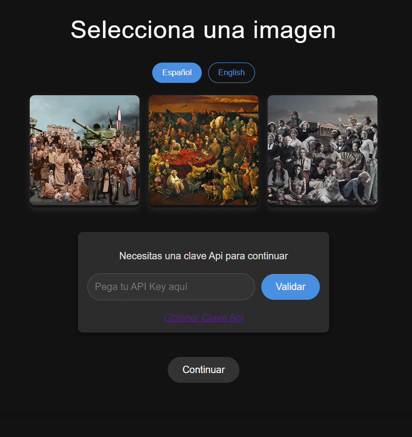
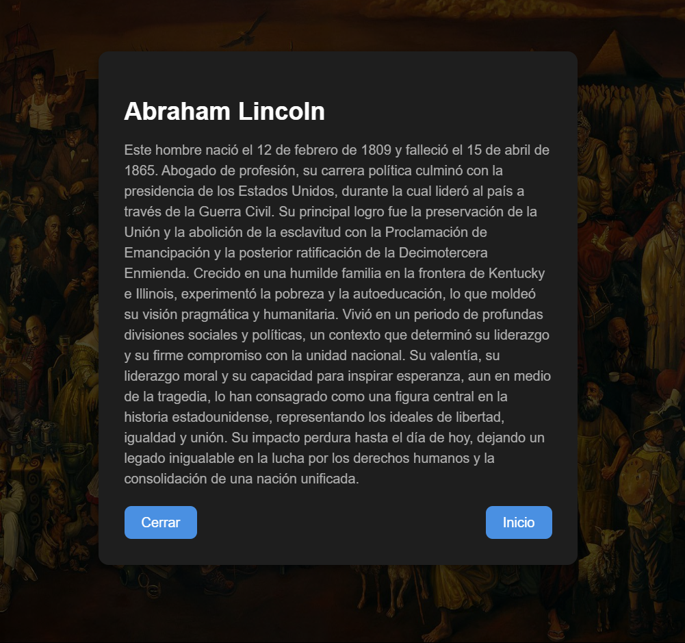

# Proyecto: Aplicación de Imágenes Interactivas

Este proyecto es una aplicación web interactiva que permite a los usuarios seleccionar imágenes, validar una API Key, obtener descripciones detalladas de personajes históricos, y visualizar la información sobre diferentes áreas de las imágenes seleccionadas.

## Tecnologías Usadas

- **React**: Librería para construir interfaces de usuario interactivas.
- **React Router**: Manejo de rutas en la aplicación.
- **i18next**: Para la internacionalización (soporte de varios idiomas).
- **GoogleGenerativeAI (gemini-1.5-flash)**: Para obtener descripciones de personajes históricos
- **CSS**: Estilos para la maquetación y diseño de la aplicación.

## Instalación

Para instalar y ejecutar este proyecto localmente, sigue estos pasos:

1. Clona el repositorio
   
2. Navega al directorio del proyecto

3. Instala las dependencias:
   ```bash
   npm install
   ```

4. Inicia el servidor de desarrollo:
   ```bash
   npm start
   ```

   El servidor estará disponible en `http://localhost:3000`.

## Estructura del Proyecto

El proyecto está compuesto por los siguientes componentes principales:

- **Home**: Página de inicio donde los usuarios pueden seleccionar una imagen, ingresar una API Key y validar si es correcta.
- **Picture**: Página que muestra una imagen seleccionada con áreas interactivas. Al pasar el mouse sobre las áreas, aparece un nombre flotante y, al hacer clic, se muestra un modal con más información.
- **CharacterDetail**: Muestra la descripción detallada de un personaje basado en la imagen seleccionada.
- **FloatName**: Componente que muestra un nombre flotante cuando el usuario pasa el mouse sobre una de las áreas de la imagen.

## Visualizacion de la web
A continuación se muestran imágenes representativas de cómo lucen las principales páginas de la aplicación:

## Pagina de inicio (Home):
Esta es la página principal donde los usuarios pueden seleccionar una imagen y validar su API Key.


## Página de Imagen Interactiva (Picture)
En esta página, los usuarios pueden ver una imagen con áreas interactivas. Al pasar el ratón sobre las áreas, se muestra un nombre flotante, y al hacer clic en una de las áreas, se obtiene más información sobre el personaje relacionado.


## Funcionalidades

1. **Selección de Imágenes**: Los usuarios pueden seleccionar imágenes de un conjunto predefinido.
2. **Validación de API Key**: Los usuarios deben ingresar una API Key válida para interactuar con la API.
3. **Interactividad con las Imágenes**: La aplicación permite hacer clic en áreas específicas de una imagen y ver más detalles sobre el personaje o área seleccionada.
4. **Internacionalización**: La aplicación soporta múltiples idiomas, como español e inglés, utilizando i18next.

## Uso de la API

La aplicación interactúa con una API para obtener descripciones de personajes históricos. El flujo para interactuar con la API es el siguiente:

1. El usuario ingresa su **API Key** en la página de inicio.
2. Si la API Key es válida, el usuario puede continuar.
3. Al hacer clic en un personaje, se hace una consulta a la API para obtener la descripción del personaje relacionado con ese personaje.

### Ejemplo de uso de la API:
- **API Key**: La clave debe ser obtenida desde [Google AI Studio](https://aistudio.google.com/app/apikey).
- **Endpoints**: Utilizamos el modelo de Google "gemini-1.5-flash" para obtener las descripciones.

